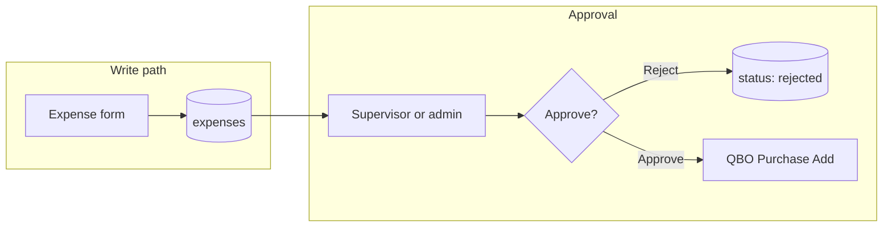

# Expense recording (QBO Purchase sync)

Employees and administrators record expenses in Ellr. Approved expenses synchronize to QuickBooks Online as **Purchase** transactions (Cash, Check, or Credit Card).

## Architecture overview

| Layer | Responsibility |
|-------|----------------|
| `expenses` | Local write model: new rows start as `pending` |
| `PurchaseService` | Maps approved expenses to QBO `Purchase` (AccountBasedExpenseLineDetail) |
| `ExpenseApprovalService` | Approve queues sync; reject stays local only |

## Status lifecycle

| Status | Editable by owner | Synced to QBO |
|--------|-------------------|---------------|
| `pending` | Yes | No |
| `approved` | No | Yes (`qbo_id` set after job) |
| `rejected` | No (deletable) | Never |

## Required fields

| Field | QBO mapping |
|-------|-------------|
| `amount` | Purchase line `Amount` |
| `txn_date` | `TxnDate` |
| `payment_type` | `PaymentType` (`Cash` / `Check` / `CreditCard`) |
| `payment_account_ref` | Purchase `AccountRef` (Bank / Credit Card) |
| `expense_account_ref` | Line `AccountBasedExpenseLineDetail.AccountRef` |
| `vendor_ref` (optional) | `EntityRef` type Vendor |
| `customer_ref` / `project_ref` (optional) | Line `CustomerRef` for job costing |
| `is_billable` | Line `BillableStatus` |
| `description` | Line `Description` |

## API routes

### Employee / any verified org user

| Method | Route | Action |
|--------|-------|--------|
| `GET` | `/api/expenses` | List own expenses |
| `POST` | `/api/expenses` | Create pending expense |
| `PATCH` | `/api/expenses/{id}` | Update pending expense |
| `DELETE` | `/api/expenses/{id}` | Delete pending/rejected expense |
| `GET` | `/api/quickbooks/expense-accounts` | Expense Chart of Accounts |
| `GET` | `/api/quickbooks/payment-accounts` | Payment accounts |
| `GET` | `/api/quickbooks/vendors` | Vendors |

### Reviewer (supervisor or admin)

| Method | Route | Action |
|--------|-------|--------|
| `GET` | `/api/expense-approvals` | List pending expenses in scope |
| `POST` | `/api/expense-approvals/{id}/approve` | Approve and queue QBO Purchase |
| `POST` | `/api/expense-approvals/{id}/reject` | Reject (local only) |

### Administrator

| Method | Route | Action |
|--------|-------|--------|
| `GET` | `/api/admin/expense-approvals` | All pending expenses in org |
| `POST` | `/api/admin/expense-approvals/{id}/approve` | Approve and sync |
| `POST` | `/api/admin/expense-approvals/{id}/reject` | Reject |

Authorization mirrors time entries: no self-review; supervisors review direct reports; admins review the whole org.

## UI surfaces

| App | Screen | Behavior |
|-----|--------|----------|
| Timesheet | Expenses tab | Create and list own expenses |
| Timesheet | Approvals tab | Review direct-report expenses (same capability as time) |
| Admin | Expenses tab | Record expenses and review pending org expenses |

## Future MCP (AI credit logging)

A later increment can expose an MCP server so LLM agents log AI credits used on a task against a QBO project. That server should call the same Ellr expense API (or a service-token variant), not Intuit directly:

| MCP tool (proposed) | Maps to |
|---------------------|---------|
| `log_ai_credit_expense` | `POST /api/expenses` with `expense_account_ref` for AI tooling, `amount`, `customer_ref` / `project_ref`, description |
| `list_project_expenses` | `GET /api/expenses` filtered by project (future query param) |

Keep QBO as the ledger; Ellr remains the governance and attribution layer (approval, org scoping, picker validation). Do not teach agents to write Purchases through the Intuit SDK.

## Related docs

- Time entry approval pattern: `docs/time-entry-approval.md`
- Profitability roadmap: `docs/project-profitability-roadmap.md` (expense sync was previously deferred past Phase B; this document is the capture path)
