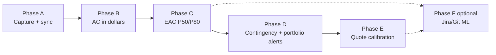

# Project profitability roadmap

**Status:** Planning only. Do not start Phase B until the current MVP (Phase A) is stabilized and QA-complete.

**Last updated:** July 30, 2026

**Purpose:** Single reference to resume strategy, sequencing, technical build, and commercial positioning. Read **Executive summary** and **Problem we solve** first; then jump to the phase matching current maturity.

---

## Table of contents

1. [Executive summary](#executive-summary)
2. [Problem we solve](#problem-we-solve)
3. [Product vision](#product-vision)
4. [What Ellr is and is not](#what-ellr-is-and-is-not)
5. [Who we serve](#who-we-serve)
6. [Messaging and pitches](#messaging-and-pitches)
7. [Architecture principle](#architecture-principle)
8. [Phase map and dependencies](#phase-map-and-dependencies)
9. [Phased implementation plan](#phased-implementation-plan)
10. [Timesheet role in the product](#timesheet-role-in-the-product)
11. [2-year AI horizon (2028)](#2-year-ai-horizon-2028)
12. [Data model sketch](#data-model-sketch)
13. [Pricing direction](#pricing-direction)
14. [Go-to-market](#go-to-market)
15. [Risks and mitigations](#risks-and-mitigations)
16. [Conversation context (for agents)](#conversation-context-for-agents)
17. [Next actions when resuming](#next-actions-when-resuming)
18. [Revision log](#revision-log)

---

## Executive summary

**Ellr** evolves from a QBO timesheet into a **project profitability cockpit** for professional services firms on QuickBooks Online.

| | |
|---|---|
| **One-liner** | QBO tells you where you were; Ellr tells you where you are going — in dollars. |
| **Core question** | What did this job cost, what will it cost at completion, and is our margin at risk? |
| **Buyer** | Owner, ops director, or controller (not the developer optimizing story points). |
| **Wedge** | Deep QBO sync + approval governance + forward-looking EAC and contingency. |
| **Not** | A PSA, a Jira analytics tool, or a ticket-hour prediction engine. |

**Build sequence:** stabilize capture and sync (A) → actual cost in dollars (B) → projected cost EAC (C) → contingency and portfolio alerts (D) → quote calibration (E) → optional Jira/Git ML (F).

**Pace rule:** Phase A is foundation only (~2–3 months post-QA max). Phase B is the first commercial milestone. Phases C–D are the 2028 product.

---

## Problem we solve

### The structural shift (AI era)

AI collapsed the **cost of building**. It did not collapse:

- the need to protect **margin per client and per job**;
- **contracts** (fixed fee, caps, T&M);
- **QBO** as the ledger accountants trust;
- the discipline to say **no** without data.

Many CEOs and owners now launch **more initiatives, features, and side projects** because shipping is cheap. That creates **strategic dispersion**: energy spreads across too many jobs, unbillable extras accumulate on fixed-fee work, and focus drifts away from core profitable clients.

> **Build cost dropped. Dispersion cost did not — it often increased.**

### The economic brake is missing

| Before AI | After AI |
|-----------|----------|
| Few projects started (expensive to build) | Many initiatives started (cheap to build) |
| Natural friction limited scope | No technical friction |
| "We can't afford it" filtered bad ideas | "We shipped it in two days" keeps bad ideas alive |
| Margin pain visible months later | Margin pain still visible months later — **unless you measure in flight** |

Ellr is the **economic brake**: visibility in dollars while work is still in progress, not only in the P&L after close.

### Symptoms we address (by phase)

| Symptom (owner / CEO) | Ellr answer | Phase |
|------------------------|-------------|-------|
| "Are we making money on this client?" | Actual cost (AC) and margin per QBO job | B |
| "Will this fixed-fee project finish under budget?" | EAC P50 / P80 | C |
| "We keep saying yes to extras — what's that costing us?" | Hours and AC on scope creep; job-level burn | B–C |
| "We're spread across too many jobs — which ones are killing margin?" | **Portfolio dashboard** — jobs ranked by margin risk | C–D |
| "Our quotes are optimistic — we always overrun" | Contingency tracking + ex-post calibration | D–E |
| "We're overcommitted vs capacity" | Capacity guard vs backlog | D |
| "The accountant sees it too late" | Alerts before month-end close | D |

### What we do not claim to solve (phase 1)

- Replacing the CEO's judgment (we surface numbers; they decide).
- Individual developer performance scoring (system metrics only; Loi 25 / GDPR safe).
- Full CRM, proposals, invoicing, or resource Gantt (PSA territory).
- Revenue recognition automation (cost side only until CPA validates).

---

## Product vision

Ellr connects **operational time and cost signals** to QuickBooks Online and gives leadership a single place to answer:

1. **What did this project cost so far?** (actual, reconciled with QBO)
2. **What will it cost at completion?** (EAC as a range, not a fake precise hour estimate)
3. **Is our margin at risk — and on which jobs should we focus?** (portfolio view, contingency, alerts)

QBO remains the **financial ledger**. Ellr is the **operational truth + forward projection** layer. Time capture (timesheet) is a **required sensor**, not the product hero.

**End state (Phases C–D live):** Owner opens Ellr Monday morning, sees all active jobs ranked by margin risk, drills into the worst one, and has the number to renegotiate scope or pause a money-losing initiative — before the accountant flags it.

---

## What Ellr is and is not

| Ellr is | Ellr is not |
|---------|-------------|
| QBO-native project margin cockpit | Generic PSA (Accelo, Kantata) |
| Forward-looking EAC and contingency in $ | Story points / velocity tooling |
| Governance on what syncs to QBO (approval) | Developer leaderboard or AI productivity scores |
| Portfolio focus for owners spread too thin | Ticket-level "this = 14 hours" oracle |
| Economic brake when build is cheap | Another commodity timesheet (long-term) |
| EN/FR-ready SMB services focus | Enterprise ERP replacement |

**Product formula:**

> Ellr is not a timesheet that adds margin as a bonus. It is a **margin cockpit** that **requires** trustworthy time and cost attribution to function.

---

## Who we serve

### Ideal customer profile (ICP)

- **15–80 FTE** professional services firm
- Already on **QuickBooks Online** (Jobs / sub-customers for projects)
- **T&M, fixed-fee, or mixed**; time still drives cost even when billing is fixed
- **Owner still involved** in sales and sometimes delivery; says "yes" too often without data
- **Quebec / Canada / EN markets** — bilingue EN/FR is a differentiator

### Primary buyer vs users

| Role | Cares about | Ellr phase |
|------|-------------|------------|
| **Owner / CEO** | Margin, focus, which clients to keep, dispersion | C–D portfolio |
| **Controller / CPA** | Reconciliation with QBO, auditable numbers | B |
| **Ops / PMO** | Budget vs actual, capacity | C–D |
| **Employee** | Fast time entry, less rework | A |
| **Supervisor** | Approval queue, billable accuracy | A |

### Who suffers most from dispersion

Firms big enough to run **5+ client jobs in parallel** plus internal initiatives, but too small for a PMO to filter every "yes." The owner needs **portfolio-level focus**, not another build tool.

---

## Messaging and pitches

Use the pitch that matches product maturity. Do not sell Phase C language before Phase C ships.

| Maturity | Pitch |
|----------|-------|
| Phase A (wedge) | "Governed timesheet that syncs cleanly to QBO — approval before it hits the books." |
| Phase B | "See what each QBO job actually cost in the last 90 days — in dollars, not guesswork." |
| **Phase C+ (primary)** | "Connect QBO. Within 24 hours, see actual and projected margin per job." |
| **CEO / dispersion angle** | "You can build 10× more now. Do you know which of those builds are making you money — and which jobs deserve your focus this week?" |
| **Scope / say-no angle** | "Do you know what each extra 'yes' to a client cost you this quarter?" |
| Phase D | "When contingency is 70% consumed at 40% progress, get alerted before the accountant sees it in the P&L." |
| Phase E | "Prove your quotes are calibrated — not optimistic fiction." |

**Metaphor (AI era):** AI is a faster engine; Ellr is the **fuel gauge and margin alarm**.

---

## Architecture principle

```
Ellr (operational truth + projections)  →  QBO (financial ledger)
        ↑                                          │
        └──────── read: confirmed actuals ─────────┘
```

| Capability | QBO | Ellr |
|------------|-----|------|
| Recorded actual cost | Yes | — |
| Invoicing, tax, AR | Yes | — |
| WIP / unbilled work | Limited | Yes |
| EAC / ETC / VAC | No | Yes |
| Future commitments (signed backlog) | No | Yes |
| Capacity vs load | No | Yes |
| Projected margin at completion | Partial UI | Yes |
| Contingency reserve consumption | No | Yes |
| Portfolio margin risk ranking | No | Yes (C–D) |

**Rates:** Own fully-loaded rates in Ellr; push computed amounts to QBO. Do not depend on Payroll/Projects cost-rate APIs (fragile).

**People:** Measure the **system**, not individuals. No developer performance UI.

---

## Phase map and dependencies



| Phase | Depends on | Unlocks |
|-------|------------|---------|
| A | QBO OAuth, realm binding | Trustworthy cost **inputs** |
| B | A stable | First **paid** tier, CFO demo |
| C | B + budgets | Core product, GTM start |
| D | C | Fixed-fee premium, CEO portfolio |
| E | D + closed projects | Moat, CPA channel |
| F | C in production (min) | Tech consultancy upsell |

**Each phase must pass exit criteria before the next starts.** Exception: spreadsheet prep for B (loaded rates) can run during late A.

---

## Phased implementation plan

Every phase follows the same template: **question answered**, **in/out of scope**, **deliverables**, **commercial value**, **success metrics**, **exit criteria**.

---

### Phase A — Operational foundation

| Field | Detail |
|-------|--------|
| **Status** | In progress — stabilize and QA |
| **User question** | "Can we trust hours getting into QBO — with approval?" |
| **Depends on** | Existing MVP codebase |
| **Duration guidance** | Complete stabilization; **max ~2–3 months post-QA** before prioritizing B |

#### In scope

- Timer and manual time entry with `customer_ref`, `project_ref`, `item_ref`, billable flag
- Supervisor/admin **approval** before QBO sync; rejected entries stay local
- Webhooks, scheduled reconcile, `time_activity_snapshots` read model
- Idempotent writes; multi-tenant org + QBO realm binding
- Admin: OAuth connect, employee ↔ QBO mapping, org timezone

#### Out of scope (defer)

- Loaded rates, margin dashboards, EAC (Phases B–C)
- Portfolio views, contingency (D)
- Calendar import, AI auto-categorization (optional later; do not block B)
- Timer UX perfection beyond "good enough for pilot"

#### Deliverables

| Layer | Items |
|-------|--------|
| Backend | `time_entries`, approval services, sync jobs, snapshot pipeline |
| Frontend | Timesheet app, approval UI (admin), connect flow |
| Ops | Docker sync, webhook tunnel docs |

#### Commercial value

**Wedge only** — "governed QBO timesheet." Not sufficient as long-term paid product.

#### Success metrics

- Pilot org logs time weekly
- Approval → QBO path reliable (create/update/delete)
- Zero P0/P1 on sync for 2+ weeks

#### Exit criteria → Phase B

- [ ] `npm run qa` and `composer qa` pass; manual sync scenarios documented
- [ ] Pilot org with real QBO jobs/sub-customers
- [ ] Loaded-rate assumptions documented (spreadsheet OK)
- [ ] Team agrees: **B is next priority**, not timesheet polish

**References:** `docs/time-entry-approval.md`, `docs/quickbooks-time-activity-sync.md`

---

### Phase B — Loaded rates and actual cost (AC)

| Field | Detail |
|-------|--------|
| **Status** | Not started |
| **User question** | "What did this job cost so far — in dollars?" |
| **Depends on** | Phase A exit criteria |
| **Effort (order of magnitude)** | 3–6 weeks |

#### In scope

- **Fully-loaded rate** model: salary + burden + tools + **AI tooling** + overhead ÷ **real** available hours (not 2080)
- Org rate table with effective dates and audit trail
- **AC computation:** approved/synced hours × rate, grouped by QBO Job and Customer
- Reconciliation: Ellr AC vs QBO TimeActivity / Projects signals; flag drift
- **Per-job dashboard:** hours, AC, billable vs non-billable, period filters
- API: cost summary per project/job ref

#### Out of scope

- EAC / forward projection (C)
- Portfolio ranking (C–D)
- Direct expense sync from Purchase/Bill (later increment; local Purchase capture via Ellr expenses has started, see `docs/expense-recording.md`)
- Blocking on AI-suggested time categorization

#### Deliverables

| Layer | Items |
|-------|--------|
| Backend | `loaded_rates` (or equivalent), AC aggregation service, reconciliation job |
| Frontend | Job cost dashboard (admin/owner); rate configuration UI |
| API | `GET /api/projects/{ref}/cost-summary` (or equivalent) |

**QBO mapping (validate API before build):**

| Business object | QBO entity |
|-----------------|------------|
| Project | Customer / sub-customer (Job) |
| Time spent | TimeActivity (`BillableStatus`) |
| Service type | Item (service) |

#### Commercial value

First **CFO-relevant** screen. Demo: connect QBO → margin/cost per job for last 90 days.

**Dispersion angle:** Makes **unbillable and misallocated hours** visible per job — first step to seeing cost of "small extras."

#### Success metrics

- AC within tolerance vs QBO Projects UI or pilot spreadsheet
- Owner or controller opens dashboard weekly
- 3+ users engaged with job cost view

#### Exit criteria → Phase C

- [ ] Pilot validates AC on 3+ real jobs
- [ ] Loaded-rate calculator signed off
- [ ] Budget input requirements gathered from pilot (contract value, hours cap)

---

### Phase C — ETC, EAC, and portfolio view

| Field | Detail |
|-------|--------|
| **Status** | Not started |
| **User question** | "What will this job cost at completion — and which jobs need my attention?" |
| **Depends on** | Phase B exit criteria |
| **Effort** | 3–5 weeks |

#### In scope

- Per-job **budget:** contract value, budgeted hours or cost cap, optional deadline, job type
- **ETC (v1):** `budget − AC` or remaining hours × blended rate
- **EAC:** `AC + ETC` → **EAC_P50**; uncertainty band → **EAC_P80**
- **Uncertainty (v1):** historical variance by job type (median + percentile); no ML required
- **Portfolio dashboard (CEO focus):** all active jobs ranked by margin risk (e.g. VAC, % contingency consumed, EAC vs budget); filters by customer, status
- Job detail: cone chart (interval narrows as % complete increases)
- Clear UI labels: **Actual (QBO)** vs **Projected (model)**

#### Out of scope

- Formal contingency budget line and burn alerts (D — builds on C)
- Quote decision logging (E)
- Jira/Git signals (F)

#### Formulas

```
AC  = actual cost to date (Phase B)
ETC = estimated cost to complete
EAC = AC + ETC
VAC = budget − EAC
```

#### Deliverables

| Layer | Items |
|-------|--------|
| Backend | `project_budgets`, ETC/EAC engine, daily `project_cost_snapshots`, portfolio query |
| Frontend | Portfolio home (owner); job EAC detail; budget edit |
| API | List portfolio risk; per-job EAC endpoints |

#### Commercial value

**Core paid tier.** GTM can start in earnest. Sells to owner/controller.

**Dispersion angle:** Owner sees **which jobs to focus on this week** — counteracts spread-too-thin without shaming individuals.

#### Success metrics

- Portfolio opened weekly by owner or ops lead
- EAC used in weekly ops meeting
- One decision traceable to Ellr (scope cut, re-quote, pause initiative)

#### Exit criteria → Phase D

- [ ] Portfolio dashboard in active use by pilot
- [ ] At least 5 jobs with budgets and EAC populated
- [ ] Pilot can articulate "top 3 jobs at risk" from Ellr without Excel

---

### Phase D — Contingency, burn alerts, and capacity

| Field | Detail |
|-------|--------|
| **Status** | Not started |
| **User question** | "Are we burning our quote padding — and are we overcommitted?" |
| **Depends on** | Phase C exit criteria |
| **Effort** | 2–4 weeks |

#### In scope

- Quote model: `expected_cost (P50) + contingency (P80 − P50) + target_margin = price`
- **Contingency consumption** tracking with defined rule (e.g. `max(0, AC − P50_path)`)
- **Alerts:** e.g. contingency 70% consumed while progress &lt; 50%; EAC_P80 &gt; contract value
- **Portfolio alerts feed:** prioritized list for CEO Monday review
- **Capacity guard (light):** committed backlog hours vs FTE × target utilization; warn when P80 capacity exceeded
- Notification channel (email or in-app; start simple)

#### Quantile = who bears overrun

| Context | Who bears overrun | Plan at |
|---------|-------------------|---------|
| Fixed price | Seller | P80–P85 |
| T&M | Client (with cap) | P50 plan, P80 cap |
| Internal initiative | Company | P50 plan; track as internal job |

#### Out of scope

- Ex-post quote calibration across many closed deals (E)
- Hard blocking of time entry when over capacity (warn only in v1)

#### Deliverables

| Layer | Items |
|-------|--------|
| Backend | Contingency engine, alert rules, `capacity_plans` (light) |
| Frontend | Alert inbox; contingency bar per job; capacity summary |
| API | Alerts list; acknowledge/dismiss |

#### Commercial value

Highest willingness to pay for **fixed-fee agencies**. CEO pitch: **economic brake** when saying yes is free but margin is not.

#### Success metrics

- Alert acted on before month-end close (documented in pilot)
- Owner cites Ellr in a "no" or re-scope conversation with client

#### Exit criteria → Phase E

- [ ] Live fixed-fee job tracked with contingency
- [ ] At least one alert fired and acted on
- [ ] Capacity warning reviewed in planning (even if not automated)

---

### Phase E — Commercial calibration

| Field | Detail |
|-------|--------|
| **Status** | Not started |
| **User question** | "Are our quotes honest — or optimistic fiction?" |
| **Depends on** | Phase D + enough closed projects |
| **Effort** | 2–3 weeks |

#### In scope

- **Quote decision log:** `quantile_used`, `committed_amount`, `predicted_p50`, `contingency`, `decided_by`, `date`, `project_id`
- **Ex-post calibration:** of last N projects quoted at P80, what % exceeded budget? Target ~20%
- Leadership dashboard (org-level, not per-person)
- Feedback: suggest default contingency adjustment when calibration drifts

#### Out of scope

- Automated revenue recognition
- ML replacement of simple historical percentiles (unless data warrants)

#### Commercial value

Differentiator vs timesheets and most PSAs. Strong **CPA / owner** pitch: provable pricing discipline.

#### Exit criteria → Phase F (optional)

- [ ] 20+ closed projects with logged quote decisions, **or** explicit decision to skip F

---

### Phase F — Delivery signals (Jira / Git) — optional

| Field | Detail |
|-------|--------|
| **Status** | Not started — **defer** until C is in production with paying pilots |
| **User question** | "Can we improve ETC with delivery signals?" (upsell) |
| **Depends on** | Phase C minimum; E recommended for ML training labels |
| **Effort** | 8–12+ weeks |

#### In scope

- Jira + Git integrations; temporal feature snapshots (avoid data leakage)
- Risk tertiles and drift detection on in-flight work
- LLM: extract ambiguity and dependencies — **not** hour estimates
- LightGBM / quantile model only when history beats median baseline

#### Out of scope

- Individual developer performance UI
- Ticket-level hour oracle as hero feature
- Starting F before C ships

#### Commercial value

Upsell for tech consultancies. Expands TAM; high build cost. **Not required for first revenue.**

---

## Timesheet role in the product

Time tracking remains **foundational** for services firms (cost and often revenue still flow from hours). Its **role in Ellr evolves by phase:**

| Phase | Timesheet role |
|-------|----------------|
| A | Primary **data capture** + approval gate |
| B | **Input** to AC (hours × rate) |
| C–D | **Sensor**; user opens app for portfolio/EAC first |
| Future | Manual entry + QBO snapshots + optional calendar/AI suggestions |

**Do not** over-invest in timer UX after A is stable. **Do** keep attribution (client/project/item/billable) excellent — that is what links dispersion to dollars.

---

## 2-year AI horizon (2028)

### Verdict

**Roadmap holds if B–D ship on schedule.** AI shifts the bottleneck from "can we build it?" to "are we still making money on this client?" — which is exactly the CEO dispersion problem Ellr addresses.

| Layer | 2028 relevance | Phase |
|-------|----------------|-------|
| Manual timesheet | Declining (commodity) | A substrate |
| Approval before QBO | Rising (fast-generated work) | A |
| AC + loaded rates (incl. AI tools) | Critical | B |
| EAC + portfolio focus | Core product | C |
| Contingency + alerts | High | D |
| Quote calibration | Moat | E |
| Jira/Git ML | Optional | F |

### Decision filter (every feature)

> *In 2 years, when time entry is largely automated, does this feature help the owner protect margin and focus on the right jobs?*

| Build | Defer |
|-------|-------|
| AC, EAC, portfolio, contingency, rates, approval, sync | Timer polish, sprint tools, dev leaderboards |
| Explain-why alerts (LLM on job risk) | Jira/ML before C is live |

### Founder discipline (dogfooding)

Use the same filter when building Ellr: AI makes it easy to scatter across features. **Ship B–C before polishing A or starting F.**

**Window:** ~2–3 years to own "QBO project margin" before Intuit and commodity trackers close the low layer.

---

## Data model sketch

Refine when Phase B technical spec opens. All financial rows carry QBO refs for audit.

| Entity | Phase | Purpose |
|--------|-------|---------|
| `loaded_rates` | B | Role/user rate, effective_from, components |
| `project_budgets` | C | QBO job ref, contract_value, budget_hours/cost, type |
| `project_cost_snapshots` | B–C | Daily AC roll-up per job |
| `project_eac_snapshots` | C | Daily EAC P50/P80 per job |
| `quote_decisions` | E | Commercial calibration log |
| `capacity_plans` | D | FTE, target utilization, period |
| `alerts` | D | Rule, job ref, fired_at, acknowledged |

---

## Pricing direction

Validate with pilots. Price on **value of avoided overrun**, not per-seat commodity.

| Tier | Indicative | Phase | Includes |
|------|------------|-------|----------|
| Starter | $99–149/mo | A–B | Timesheet, sync, basic job hours |
| Growth | $249–399/mo | B | Loaded rates, AC/margin per job |
| Pro | $499–799/mo | C–D | EAC, portfolio, contingency, alerts |
| Enterprise add-ons | TBD | E–F | Calibration, Jira/Git, multi-entity |

---

## Go-to-market

**Start serious GTM at Phase C demo** (portfolio + EAC). Earlier: design partners and accountants.

| Channel | When |
|---------|------|
| QBO accountants / bookkeepers | B onward |
| Founder network (owners, PMO) | C onward |
| Content: "project margin QBO", "stop dispersing margin" (EN + FR) | C onward |
| Intuit App Store | After support process mature |

**Pilot success signals:**

- Owner opens **portfolio** weekly (not only timesheet)
- Decision influenced by Ellr (scope, quote, pause job)
- Willingness to pay ≥ $200/mo

---

## Risks and mitigations

| Risk | Mitigation |
|------|------------|
| Perceived as "just another timesheet" | Ship B/C quickly; lead with portfolio + EAC pitch |
| CEO dispersion not in messaging | Use dispersion pitches from [Messaging](#messaging-and-pitches) |
| Lingering on Phase A | Hard cap ~2–3 months post-QA; B is commercial priority |
| Intuit AI on Projects | Ship B–E; moat = rates, contingency, calibration, portfolio |
| Low timesheet adoption | Simple UX; supervisor enforcement via approval |
| Scope creep to PSA or Jira-first | This doc as scope gate; F is optional |
| Founder dispersion while building Ellr | Decision filter; B before polish or F |
| QBO API gaps | Compute margin in Ellr; own rates |
| Revenue recognition | Cost only until CPA validates |
| Individual performance scoring | Never in UI; system metrics only |

---

## Conversation context (for agents)

### Sources

- **Cursor agent sessions:** July 30, 2026 (strategy, AI horizon, CEO dispersion, timesheet role).
- **Agent transcripts:** search for `story points`, `EAC`, `profitability`, `QBO`, `contingency`, `dispersion`, `CEO`, `AI horizon`, `portfolio`.
- **External:** [Death of Story Points (McQueen)](https://www.linkedin.com/pulse/death-story-points-how-ai-finally-makes-agile-work-geoff-mcqueen-lbyhf/)
- **Internal brainstorm:** Jira/Git risk, ML calibration, EAC/ETC/VAC, loaded rates, capacity, quote calibration.

### Decisions (do not re-litigate without new evidence)

| Topic | Decision |
|-------|----------|
| Wedge | QBO-native project profitability in **dollars** |
| CEO problem | **Dispersion** when build is cheap; Ellr = economic brake + portfolio focus |
| Prediction | Risk and drift; EAC as range; not ticket-hour oracle |
| Timesheet | Required **sensor**; not long-term hero |
| QBO | Ledger; Ellr = operational truth + projections |
| Jira/Git | Phase F optional |
| People metrics | System only; no individual scoring UI |

### Current codebase (Phase A baseline)

| Asset | Role |
|-------|------|
| `time_entries` | Write model; approval before QBO |
| `time_activity_snapshots` | Read model; sync |
| `customer_ref` / `project_ref` | Job attribution |
| Approval + sync infra | Governance + reliability |

### Prerequisite before Phase B

- [ ] Phase A exit criteria complete
- [ ] Pilot org on weekly timesheet + approval + sync
- [ ] Loaded-rate spreadsheet for pilot

---

## Next actions when resuming

1. Read [Executive summary](#executive-summary) and [Problem we solve](#problem-we-solve).
2. Confirm current **phase** and check **exit criteria** for that phase only.
3. If Phase A: finish QA; do not start B until checklist complete.
4. If starting B: open technical spec from [Data model sketch](#data-model-sketch); run loaded-rate workshop.
5. Re-read [2-year AI horizon](#2-year-ai-horizon-2028) before prioritizing timesheet polish or Phase F.
6. Use [Decision filter](#decision-filter-every-feature) for any new feature idea.

---

## Revision log

| Date | Change |
|------|--------|
| 2026-07-30 | Initial roadmap (EAC/QBO brainstorm, commercial analysis). |
| 2026-07-30 | Added 2-year AI horizon, pace rule, expanded risks. |
| 2026-07-30 | **Full revision:** executive summary, problem statement (CEO dispersion), messaging, phase template, portfolio dashboard (C), dependencies diagram, timesheet role, coherent exit criteria, agent context. |
