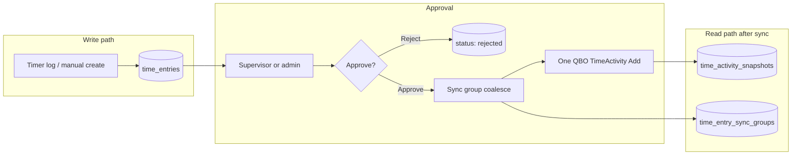

# Time entry approval (Phase 3)

Supervisor approval is required before employee time entries are synchronized to QuickBooks Online (QBO).

## Architecture overview



| Layer | Responsibility |
|-------|----------------|
| `time_entries` | **Write model**: all new entries start here as `pending` |
| `time_entry_sync_groups` | **Audit model**: which local rows were pushed as one QBO activity |
| `time_activity_snapshots` | **Read model**: QBO-synced activities (unchanged Phase 2 design) |
| `users.supervisor_id` | Routes pending entries to the employee's supervisor |
| `TimeEntryApprovalService` | Approve queues grouped QBO sync; reject keeps the row local only |

## Status lifecycle

| Status | Editable by employee | Synced to QBO |
|--------|---------------------|---------------|
| `pending` | Yes | No |
| `approved` | No | Yes (`qbo_id` set) |
| `rejected` | No (deletable) | Never |

## API routes

### Employee (`auth:sanctum`, `organization`, `verified.email`)

| Method | Route | Action |
|--------|-------|--------|
| `GET` | `/api/time-entries` | List own entries (all statuses) |
| `POST` | `/api/time-entries` | Create pending entry |
| `PATCH` | `/api/time-entries/{id}` | Update pending entry |
| `DELETE` | `/api/time-entries/{id}` | Delete pending/rejected entry |

`POST /api/time-activities` and `POST /api/time-tracker/log` also create **pending** local entries (backward-compatible paths).

### Reviewer (supervisor of employee, or org admin)

| Method | Route | Action |
|--------|-------|--------|
| `GET` | `/api/time-entry-approvals` | List pending entries for direct reports |
| `POST` | `/api/time-entry-approvals/{id}/approve` | Approve and sync to QBO |
| `POST` | `/api/time-entry-approvals/{id}/reject` | Reject (stays local) |

### Administrator (`middleware: admin`)

| Method | Route | Action |
|--------|-------|--------|
| `GET` | `/api/admin/time-entry-approvals` | List all pending entries in org |
| `POST` | `/api/admin/time-entry-approvals/{id}/approve` | Approve and sync |
| `POST` | `/api/admin/time-entry-approvals/{id}/reject` | Reject |
| `PATCH` | `/api/admin/users/{user}/supervisor` | Assign supervisor |

## Authorization rules

- Employees cannot review their own entries.
- Supervisors review entries where `employee.supervisor_id = reviewer.id`.
- Org administrators (`is_admin`) can review any pending entry in their organization.
- Rejected entries are never sent to QBO.

## UI surfaces

| App | Screen | Behavior |
|-----|--------|----------|
| Timesheet | Recent entries | Shows approval status (`pending`, `approved`, `rejected`) |
| Admin | Time approvals tab | List, approve, reject pending entries |

## Supervisor assignment

Assign a supervisor per timesheet user via `PATCH /api/admin/users/{user}/supervisor` with `{ "supervisor_id": <user_id> }` or `null` to clear.

Supervisors must belong to the same organization. An employee cannot be their own supervisor.

## Grouped QuickBooks sync

Grouping is **opt-in at approval time**. The admin or supervisor chooses whether matching entries should coalesce into one QuickBooks `TimeActivity`.

Approve payload:

```json
{ "group_for_qbo": true }
```

Default is `false` (one QuickBooks activity per approved entry). When `group_for_qbo` is `true`, approved entries that share the same **employee**, **calendar day** (company timezone), **customer/project**, **service item**, and **billable** flag are coalesced into **one** QuickBooks `TimeActivity`.

| Mechanism | Behavior |
|-----------|----------|
| Reviewer choice | Stored on `time_entries.group_for_qbo`; only opted-in siblings are locked together |
| Unique delayed job | When grouping, `SyncApprovedTimeEntryToQuickBooksJob` is unique per group key; default delay `QUICKBOOKS_TIME_ENTRY_SYNC_GROUP_DELAY_SECONDS` (15s) lets near-simultaneous opt-in approvals share one push |
| Solo sync | When not grouping, the job key includes `\|solo:{entryId}` and runs without coalesce delay |
| Local linkage | All member rows get the same `qbo_id` and `sync_group_id` |
| QBO Description | Summary plus `Details: {FRONTEND_ADMIN_URL}/?sync_group={public_id}` and per-entry clock/notes |
| Drill-down API | `GET /api/time-entry-sync-groups/{publicId}` for employee, supervisor, or org admin |
| UI | Approval cards expose a “Group matching entries in QuickBooks” checkbox (off by default) |

### Bidirectional sync notes

- Phase 2 webhooks/reconcile still update **`time_activity_snapshots` only** (the single aggregated QBO activity).
- Local member rows remain the **source of detail** for audit. If hours change in QBO, Ellr does not rewrite member durations.
- Approvals that land **after** a group already synced create a **new** group (no silent mutate of an existing QBO activity).

## Legacy QBO entries

Entries that exist only in QuickBooks (or predate the approval workflow) are included in `GET /api/time-entries` with:

- `status: approved`
- `list_id: qbo:{qbo_id}`
- no local `id`

They are excluded when a local `time_entries` row already references the same `qbo_id`.

## Related code

| Piece | Location |
|-------|----------|
| Model | `backend/app/Models/TimeEntry.php`, `TimeEntrySyncGroup.php` |
| Enum | `backend/app/Enums/TimeEntryStatus.php` |
| Services | `TimeEntryService`, `TimeEntryApprovalService`, `TimeEntryQboGroupSyncService`, `TimeEntrySyncGroupService` |
| Controllers | `TimeEntryController`, `TimeEntryApprovalController`, `TimeEntrySyncGroupController` |
| API client | `packages/api-client/src/timeEntries.ts` |
| Admin UI | `apps/admin/src/components/TimeEntryApprovalsPanel.tsx`, sync group dialog in `@ellr/ui` |
| Phase 2 sync | `docs/quickbooks-time-activity-sync.md` |
