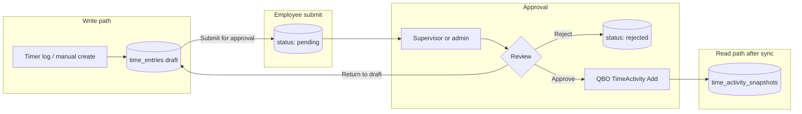

# Time entry approval (Phase 3)

Supervisor approval is required before employee time entries are synchronized to QuickBooks Online (QBO).

## Architecture overview

| Layer | Responsibility |
|-------|----------------|
| `time_entries` | **Write model**: new entries start as `draft`; submit moves them to `pending` |
| `time_activity_snapshots` | **Read model**: QBO-synced activities (unchanged Phase 2 design) |
| `users.supervisor_id` | Routes pending entries to the employee's supervisor |
| `TimeEntryApprovalService` | Approve pushes to QBO; reject keeps the row local; return-to-draft soft-unsubmits |

## Status lifecycle

| Status | Employee | Admin / supervisor | In Time approvals | Synced to QBO |
|--------|----------|--------------------|-------------------|---------------|
| `draft` | Edit + delete + submit | Return pending to draft (soft unsubmit) | No | No |
| `pending` | Read-only | Edit + approve / reject / return to draft | Yes | No |
| `approved` | Read-only | Read-only (edit in QuickBooks only) | No | Yes (`qbo_id` set) |
| `rejected` | Edit + delete + resubmit | No list (not pending) | No | Never |

**Log Time** creates `draft`. Employees typically submit drafts at the end of the work week. Existing `pending` rows remain pending (already submitted).

## API routes

### Employee (`auth:sanctum`, `organization`, `verified.email`)

| Method | Route | Action |
|--------|-------|--------|
| `GET` | `/api/time-entries` | List own entries (all statuses) |
| `POST` | `/api/time-entries` | Create draft entry |
| `PATCH` | `/api/time-entries/{id}` | Update draft or rejected entry |
| `DELETE` | `/api/time-entries/{id}` | Delete draft or rejected entry |
| `POST` | `/api/time-entries/{id}/submit` | Submit one draft/rejected entry |
| `POST` | `/api/time-entries/submit` | Submit all (or selected) draft/rejected entries |

`POST /api/time-activities` and `POST /api/time-tracker/log` also create **draft** local entries (backward-compatible paths).

### Reviewer (supervisor of employee, or org admin)

| Method | Route | Action |
|--------|-------|--------|
| `GET` | `/api/time-entry-approvals` | List pending entries for direct reports |
| `PATCH` | `/api/time-entry-approvals/{id}` | Update a pending entry before review |
| `POST` | `/api/time-entry-approvals/{id}/approve` | Approve and sync to QBO |
| `POST` | `/api/time-entry-approvals/{id}/reject` | Reject (stays local only) |
| `POST` | `/api/time-entry-approvals/{id}/return-to-draft` | Soft unsubmit back to draft |

### Administrator (`middleware: admin`)

| Method | Route | Action |
|--------|-------|--------|
| `GET` | `/api/admin/time-entry-approvals` | List all pending entries in org |
| `PATCH` | `/api/admin/time-entry-approvals/{id}` | Update a pending entry before review |
| `POST` | `/api/admin/time-entry-approvals/{id}/approve` | Approve and sync |
| `POST` | `/api/admin/time-entry-approvals/{id}/reject` | Reject |
| `POST` | `/api/admin/time-entry-approvals/{id}/return-to-draft` | Soft unsubmit back to draft |
| `PATCH` | `/api/admin/users/{user}/supervisor` | Assign supervisor |

## Authorization rules

- Employees cannot review their own entries.
- Supervisors review entries where `employee.supervisor_id = reviewer.id`.
- Org administrators (`is_admin`) can review any pending entry in their organization.
- Rejected entries are never sent to QBO.
- Employee edits stop once an entry is `pending`; only reviewers may edit pending rows.

## UI surfaces

| App | Screen | Behavior |
|-----|--------|----------|
| Timesheet | Recent entries | Draft/rejected: edit, submit, delete; bulk submit all drafts |
| Timesheet / Admin | Time approvals | List pending; edit then approve, reject, or return to draft |
| Admin | Employee Time entries dialog | QBO-synced snapshots only (read-only); edit approved time in QuickBooks |

## Supervisor assignment

Assign a supervisor per timesheet user via `PATCH /api/admin/users/{user}/supervisor` with `{ "supervisor_id": <user_id> }` or `null` to clear.

Supervisors must belong to the same organization. An employee cannot be their own supervisor.

## Legacy QBO entries

Entries that exist only in QuickBooks (or predate the approval workflow) are included in `GET /api/time-entries` with:

- `status: approved`
- `list_id: qbo:{qbo_id}`
- no local `id`

They are excluded when a local `time_entries` row already references the same `qbo_id`.

## Related code

| Piece | Location |
|-------|----------|
| Model | `backend/app/Models/TimeEntry.php` |
| Enum | `backend/app/Enums/TimeEntryStatus.php` |
| Services | `TimeEntryService`, `TimeEntrySubmitService`, `TimeEntryApprovalService`, `TimeEntryAuthorizationService` |
| Controllers | `TimeEntryController`, `TimeEntrySubmitController`, `TimeEntryApprovalController` |
| API client | `packages/api-client/src/timeEntries.ts` |
| Admin UI | `apps/admin/src/components/TimeEntryApprovalsPanel.tsx` |
| Timesheet UI | `apps/timesheet/src/components/TimesheetDashboard.tsx` |
| Phase 2 sync | `docs/quickbooks-time-activity-sync.md` |
